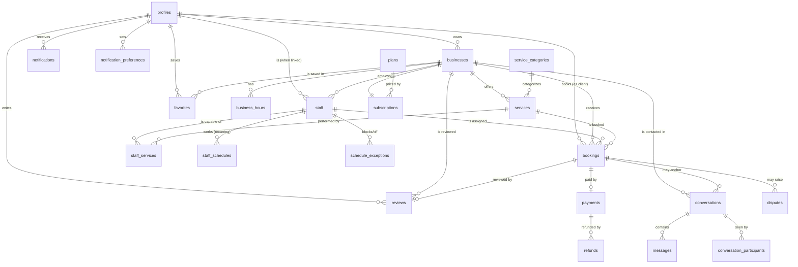

# Krowned — Database Schema (Foundation)

**Stack:** Next.js (App Router) · Supabase (Postgres + Auth + Realtime + RLS) · Stripe Connect (Express) + Stripe Billing · Vercel
**Status:** Foundation draft for review — the PRD and all build work assemble on top of this.

---

## 1. Core design principles

These are the decisions baked into the schema. Read them first; every table choice flows from here.

1. **One identity, many hats.** Every person is a single `auth.users` row with a `profiles` extension. Roles are not stored as a fixed label on the person — they are *derived from relationships*. You are a **client** simply by existing; you are a **business owner** because you own a `businesses` row; you are **staff** because a `staff` row links you to a business; you are a **super admin** because `profiles.platform_role = 'super_admin'`. This lets the same human book an appointment *and* run a salon without duplicate accounts.

2. **A business is the tenant. A solo pro is just a business with one staff record (themselves).** There is no separate "solo" concept anywhere. Sarah owns the studio and is also a staff provider; David is staff-only; a solo nail tech is owner + sole staff. The booking engine never special-cases solo operators.

3. **An owner who never performs services simply has no `staff` row.** A spa manager owns the business, manages it, but isn't bookable. Supported for free by the model above.

4. **The same business plays two opposite roles in Stripe at once.**
   - As a **Connect connected account** it *receives* money from clients (`stripe_connect_account_id`).
   - As a **Billing customer** it *pays you* the monthly subscription (`stripe_billing_customer_id`).
   These are different Stripe objects with different APIs, webhooks, and lifecycles. Never conflate them.

5. **Money flow.** Client pays full price up front (or pays at the store). On an online prepay charge: the client is charged `service + tip`; Stripe takes its processing cut; your **platform fee applies to the service amount only** (`platform_fee = service × commission_rate`); the **tip passes through 100%** to the business's connected account. Pay-at-store bookings move no money through Stripe and earn no platform fee.

6. **Service-first, staff-optional booking.** A client always picks a service; picking a staff member is optional. If they don't pick one, the system auto-assigns a staff member who (a) is mapped as *capable* of that service and (b) is *free* at that slot. This requires an explicit `staff_services` capability map, and means availability is always computed against specific people.

7. **Freemium: every business is always on a plan.** There are exactly two tiers, and a business *always* points at one.
   - **Free (forever, $0)** — pure **visibility**: a directory + search listing and a basic public profile. **Not bookable at all** — no booking engine, no online payments, no staff, no messaging. It exists for discovery, SEO density, and as the conversion funnel into Premium.
   - **Premium (paid, per-seat)** — the real product: the booking engine, online prepay + tips, multiple staff seats, in-app messaging, earnings/analytics, full profile, featured-placement eligibility, and a **shareable booking link**.
   New businesses default to Free but are offered an immediate **14-day full-Premium trial** (no feature caps during trial — the trial *is* Premium). On trial-end-without-conversion or payment failure (after Stripe dunning), the business **downgrades to Free — never deleted, never locked out**: data, staff, and services are retained but Premium features lock and the booking engine turns off. Already-scheduled (and prepaid) future bookings are still honored. Resubscribing instantly reactivates everything. `plans.features` (jsonb) is the single source of truth for every gate/quota, so limits change without a migration.

8. **Three revenue mechanisms coexist on every Premium business:** per-booking platform fee (Connect), the per-seat subscription (Billing), and a paid featured-placement flag. The Boost-style "30% of a net-new client's first visit" commission is **deferred to v2** — but the **shareable booking link makes the attribution it needs cheap to capture now**: every booking records a `source` (`marketplace` vs `direct_link` vs `manual`), which is exactly the marketplace-discovery-vs-own-client signal v2 Boost depends on. Capturing it from day one means no backfill later.

9. **In-app messaging and email notifications are two separate systems** with two separate tables (`messages` vs `notifications`). They feel related but have different shapes and lifecycles. Messaging is business-scoped and optionally pinned to a booking; notifications are system events with a per-user/per-event channel preference.

---

## 2. Entity relationship overview

---

## 3. Enums

| Enum | Values | Used by |
|---|---|---|
| `platform_role` | `user`, `super_admin` | `profiles.platform_role` |
| `verification_status` | `pending`, `verified`, `suspended`, `rejected` | `businesses.verification_status` |
| `subscription_status` | `trialing`, `active`, `past_due`, `canceled`, `incomplete` | `subscriptions.status`, mirrored on `businesses` |
| `staff_status` | `invited`, `active`, `inactive` | `staff.status` |
| `payment_option` | `prepay`, `pay_at_store`, `both` | `services.payment_option`, `businesses.default_payment_option` |
| `payment_method` | `prepay`, `pay_at_store` | `bookings.payment_method` (the client's actual choice) |
| `booking_status` | `pending`, `confirmed`, `in_progress`, `completed`, `cancelled`, `no_show` | `bookings.status` |
| `booking_source` | `marketplace`, `direct_link`, `manual` | `bookings.source` |
| `plan_tier` | `free`, `premium` | `plans.tier` |
| `payment_status` | `requires_payment`, `processing`, `succeeded`, `failed`, `refunded`, `partially_refunded` | `payments.status` |
| `review_status` | `published`, `flagged`, `removed` | `reviews.status` |
| `dispute_status` | `open`, `under_review`, `resolved`, `rejected` | `disputes.status` |
| `notification_channel` | `in_app`, `email` | `notification_preferences` |

`day_of_week` is stored as a smallint (0 = Sunday … 6 = Saturday) rather than an enum, for easy range math.

---

## 4. Tables by domain

> Notation: **PK** primary key · **FK** foreign key · *RLS* = row-level-security intent. Every table has RLS enabled. `created_at`/`updated_at timestamptz` are assumed on every table and omitted from the lists below for brevity.

### 4.1 Identity & roles

#### `profiles`
Extends `auth.users` (1:1, same UUID). The single record for any human.

| Column | Type | Notes |
|---|---|---|
| `id` | uuid **PK** | = `auth.users.id` |
| `full_name` | text | |
| `avatar_url` | text | |
| `phone` | text | |
| `country` | text | ISO code; drives currency/locale defaults |
| `platform_role` | `platform_role` | `user` default; `super_admin` for admins only |
| `stripe_customer_id` | text | **As a client** — saved cards for paying businesses. Distinct from the business billing customer. |

*RLS:* a user reads/updates only their own row. Super admin reads all. Public can read a thin subset (name, avatar) only via a view used for staff bios / reviews.

---

### 4.2 Business (tenant)

#### `businesses`
The tenant. One owner. Carries both Stripe roles + the denormalized subscription + featured state.

| Column | Type | Notes |
|---|---|---|
| `id` | uuid **PK** | |
| `owner_id` | uuid **FK → profiles** | the managing owner |
| `name` | text | |
| `slug` | text unique | public URL `/b/{slug}` |
| `description` | text | |
| `primary_category_id` | uuid **FK → service_categories** | for browse/SEO |
| `phone` / `email` | text | public contact |
| `address` | text | single location in v1 |
| `city` / `country` | text | |
| `latitude` / `longitude` | numeric | for "near you" search |
| `logo_url` / `cover_url` | text | |
| `gallery` | jsonb | array of image URLs |
| `amenities` | jsonb | parking, wifi, accessible, etc. |
| `default_payment_option` | `payment_option` | business-wide default; services can override |
| `commission_rate` | numeric | platform fee %, **per-business** (default e.g. 0.05) — never hardcode |
| `verification_status` | `verification_status` | drives the "Verified" badge + admin approval |
| `stripe_connect_account_id` | text | **receives** client money |
| `charges_enabled` | bool | mirror of Stripe Connect `charges_enabled`; **online booking gated on this** |
| `payouts_enabled` | bool | mirror |
| `stripe_billing_customer_id` | text | **pays you** the subscription |
| `plan_id` | uuid **FK → plans** | the tier the business is on; **always set** (Free or Premium) |
| `subscription_status` | `subscription_status` | denormalized from `subscriptions` for fast gating/RLS |
| `trial_ends_at` | timestamptz | 14-day full-Premium trial |
| `booking_link_token` | text unique | the shareable booking link `/book/{token}` — stable, survives slug changes |
| `is_featured` | bool | featured placement (paid; Premium-only) |
| `featured_until` | timestamptz | |
| `is_published` | bool | owner can unpublish; admin can suspend |

*RLS:* public reads only `verification_status = 'verified' AND is_published = true` (Free and Premium alike — both appear in the directory). Owner reads/writes their own. Staff of the business can read it. Super admin full access.

> **Gating logic, stated once (tier-driven):**
> - **Listed in directory / search:** any verified, published business — **Free or Premium**. (Free's entire purpose.)
> - **Booking engine on at all:** `plan.tier = 'premium' AND subscription_status IN ('trialing','active')`. Free businesses show a profile with **no Book button**.
> - **Online prepay + tips:** the above **AND** `charges_enabled = true` (Stripe Connect complete). A Premium business mid-Stripe-onboarding can still take pay-at-store bookings.
> - **Pay-at-store bookings:** booking engine on (no Stripe needed).
> - **On lapse** (`canceled`, or `past_due` exhausting dunning): `plan_id` is **switched to the Free plan**. Listing stays visible; booking engine + Premium features lock; staff beyond the Free quota go `inactive` (not deleted); already-scheduled prepaid bookings are honored. Resubscribe → instant reactivation.
>
> Per-feature quota checks (max staff, max bookable services, messaging on/off, featured eligibility) read from `plans.features`, enforced **server-side on write**.

> **The shareable booking link is the "own your clients" feature** — the deliberate counter to Booksy's biggest vendor complaint (*"clients belong to the platform"*). A Premium business shares `/book/{booking_link_token}` directly with their own clientele (bio, WhatsApp, IG), sending them straight into booking, bypassing marketplace discovery. Bookings through it are tagged `source = 'direct_link'`; marketplace-discovered ones are `source = 'marketplace'`. That distinction is both a trust/loyalty win now and the exact attribution v2 Boost needs later.

#### `business_hours`
The opening-hours envelope. Staff availability is computed *within* these.

| Column | Type | Notes |
|---|---|---|
| `id` | uuid **PK** | |
| `business_id` | uuid **FK → businesses** | |
| `day_of_week` | smallint | 0–6 |
| `open_time` / `close_time` | time | null row = closed that day |

*RLS:* public read for verified businesses; owner write.

---

### 4.3 Staff

#### `staff`
A provider attached to a business. Links to a `profiles` row once the invite is accepted.

| Column | Type | Notes |
|---|---|---|
| `id` | uuid **PK** | |
| `business_id` | uuid **FK → businesses** | |
| `user_id` | uuid **FK → profiles** *nullable* | null while `status = 'invited'`; set on accept |
| `invited_email` | text | where the invite was sent |
| `invite_token` | text | single-use; nulled on accept |
| `invite_expires_at` | timestamptz | |
| `display_name` | text | shown publicly |
| `title` | text | "Hair Stylist", "Barber" |
| `bio` | text | |
| `avatar_url` | text | |
| `status` | `staff_status` | `invited` → `active` → `inactive` |

*RLS:* public reads `active` staff of verified businesses (for the profile page). Owner manages all staff of their business. A staff user reads/updates their own staff row. Super admin full.

> The owner-as-provider is just a `staff` row whose `user_id = businesses.owner_id`. The owner-who-doesn't-perform has **no** `staff` row.

---

### 4.4 Services & capability

#### `service_categories`
Global taxonomy, admin-managed (Hair & Barber, Nails, Spa & Massage, …).

| Column | Type | Notes |
|---|---|---|
| `id` | uuid **PK** | |
| `name` | text | |
| `slug` | text unique | SEO category pages |
| `icon` | text | |
| `sort_order` | int | |

*RLS:* public read; super admin write.

#### `services`
A bookable service offered by a business.

| Column | Type | Notes |
|---|---|---|
| `id` | uuid **PK** | |
| `business_id` | uuid **FK → businesses** | |
| `category_id` | uuid **FK → service_categories** | |
| `name` | text | |
| `description` | text | |
| `price_amount` | integer | **minor units** (cents/etc.) — never floats for money |
| `currency` | text | ISO 4217, defaults from business country |
| `duration_minutes` | int | drives slot length |
| `payment_option` | `payment_option` | overrides business default (e.g. force prepay on bridal) |
| `is_active` | bool | |

*RLS:* public read (active services of verified businesses); owner write.

#### `staff_services` — the capability map
Which staff can perform which service. **This is what makes "any available staff" work.**

| Column | Type | Notes |
|---|---|---|
| `staff_id` | uuid **FK → staff** | composite **PK** with `service_id` |
| `service_id` | uuid **FK → services** | |

*RLS:* public read (needed to compute availability); owner write.

---

### 4.5 Availability

#### `staff_schedules`
Recurring weekly working hours per staff member.

| Column | Type | Notes |
|---|---|---|
| `id` | uuid **PK** | |
| `staff_id` | uuid **FK → staff** | |
| `day_of_week` | smallint | 0–6 |
| `start_time` / `end_time` | time | |

#### `schedule_exceptions`
One-off blocks: time off, holidays, "block this slot," lunch on a specific day.

| Column | Type | Notes |
|---|---|---|
| `id` | uuid **PK** | |
| `staff_id` | uuid **FK → staff** | |
| `starts_at` / `ends_at` | timestamptz | the blocked window |
| `reason` | text | optional |
| `is_available` | bool | default false (a block); true = added one-off availability |

*RLS for both:* the staff user manages their own; owner manages their business's staff; public reads (needed to compute open slots). Booking-slot availability = `business_hours` ∩ `staff_schedules` − `schedule_exceptions` − existing `bookings`.

---

### 4.6 Bookings

#### `bookings`
The center of the system.

| Column | Type | Notes |
|---|---|---|
| `id` | uuid **PK** | |
| `client_id` | uuid **FK → profiles** | the person booking |
| `business_id` | uuid **FK → businesses** | |
| `service_id` | uuid **FK → services** | |
| `staff_id` | uuid **FK → staff** | resolved at booking time even if client chose "any" |
| `staff_chosen_by_client` | bool | false = auto-assigned (useful for analytics) |
| `source` | `booking_source` | `marketplace` / `direct_link` / `manual` — own-client vs discovery attribution (feeds v2 Boost) |
| `starts_at` / `ends_at` | timestamptz | |
| `status` | `booking_status` | |
| `payment_method` | `payment_method` | the client's actual choice for this booking |
| `service_amount` | integer | minor units, snapshot of price at booking |
| `tip_amount` | integer | 0 unless tipped |
| `platform_fee_amount` | integer | `service_amount × commission_rate`, snapshot |
| `currency` | text | |
| `client_note` | text | "please have my number…" style notes |
| `cancelled_by` | uuid **FK → profiles** *nullable* | |
| `cancellation_reason` | text | |

*RLS:* the client reads/cancels their own. The owner reads all bookings of their business. A staff user reads only bookings where `staff_id` is theirs. Super admin full. **Writes go through server-side functions** (slot validation, Stripe), not direct client inserts.

---

### 4.7 Payments

#### `payments`
One row per booking that involves money through Stripe (prepay).

| Column | Type | Notes |
|---|---|---|
| `id` | uuid **PK** | |
| `booking_id` | uuid **FK → bookings** unique | |
| `stripe_payment_intent_id` | text | |
| `amount` | integer | total charged = service + tip, minor units |
| `tip_amount` | integer | passthrough portion |
| `application_fee_amount` | integer | your platform fee (service × rate) |
| `currency` | text | |
| `status` | `payment_status` | |

#### `refunds`
| Column | Type | Notes |
|---|---|---|
| `id` | uuid **PK** | |
| `payment_id` | uuid **FK → payments** | |
| `stripe_refund_id` | text | |
| `amount` | integer | supports partial |
| `reason` | text | |
| `status` | text | |

#### `payouts` *(read-only mirror, optional but recommended)*
Mirrors Stripe payouts to a connected account, purely so the Earnings page can show payout history without a live Stripe call each load.

| Column | Type | Notes |
|---|---|---|
| `id` | uuid **PK** | |
| `business_id` | uuid **FK → businesses** | |
| `stripe_payout_id` | text | |
| `amount` | integer | |
| `currency` | text | |
| `status` | text | |
| `arrival_date` | date | |

*RLS for all three:* owner reads their business's rows; staff read nothing here (earnings exposure is owner-level — staff earnings are derived from their own bookings instead); super admin full. All writes are webhook-driven server-side.

---

### 4.8 Subscriptions (Billing — the money *you* make from vendors)

#### `plans`
Data-driven so pricing/limits change without a migration. **Two rows in v1: Free and Premium.** Every business's `plan_id` points at one of these. `features` is the authoritative gate/quota source.

| Column | Type | Notes |
|---|---|---|
| `id` | uuid **PK** | |
| `tier` | `plan_tier` | `free` or `premium` |
| `name` | text | "Free", "Zawadi Pro" |
| `base_price` | integer | per-business monthly, minor units (0 for Free; can be 0 for Premium if pure per-seat) |
| `per_seat_price` | integer | per active staff seat / month (0 for Free) |
| `currency` | text | |
| `trial_days` | int | 14 (Premium); 0 (Free) |
| `stripe_price_id` | text | the Stripe Billing price (null for Free — no Stripe object) |
| `features` | jsonb | **source of truth for gates/quotas**, e.g. `{ "bookable": false, "online_payments": false, "max_staff": 0, "max_bookable_services": 0, "messaging": false, "featured_eligible": false, "shareable_link": false }` for Free; all unlocked/unlimited for Premium |
| `is_active` | bool | |

> **Free plan `features`:** `bookable:false` (visibility only). **Premium:** `bookable:true, online_payments:true, max_staff:null (unlimited), max_bookable_services:null, messaging:true, featured_eligible:true, shareable_link:true`. The **trial** runs on the Premium plan with `status='trialing'` — *full* Premium features, no separate trial caps.

#### `subscriptions`
One per business, present only while a business **has or had Premium** (a pure-Free business that never trialed needs no row — `businesses.plan_id` simply points at Free). Canonical Premium-billing state; `businesses.subscription_status` is a denormalized mirror for fast gating.

| Column | Type | Notes |
|---|---|---|
| `id` | uuid **PK** | |
| `business_id` | uuid **FK → businesses** unique | |
| `plan_id` | uuid **FK → plans** | the Premium plan (Free needs no subscription) |
| `stripe_subscription_id` | text | |
| `status` | `subscription_status` | |
| `seat_count` | int | = active staff; drives metered per-seat billing |
| `current_period_end` | timestamptz | |
| `trial_ends_at` | timestamptz | |
| `cancel_at_period_end` | bool | |

*RLS:* owner reads their own; super admin full; writes webhook-driven.

> **Downgrade is a `plan_id` swap, not a delete.** When a subscription reaches `canceled` (or `past_due` exhausts Stripe dunning), a webhook handler sets `businesses.plan_id` → Free plan and `subscription_status` → `canceled`. The `subscriptions` row is **kept** (history + frictionless resubscribe). Staff beyond the Free quota flip to `inactive`. Nothing is destroyed.

---

### 4.9 Reviews

#### `reviews`
One review per completed booking.

| Column | Type | Notes |
|---|---|---|
| `id` | uuid **PK** | |
| `booking_id` | uuid **FK → bookings** unique | guarantees "confirmed client" reviews only |
| `client_id` | uuid **FK → profiles** | |
| `business_id` | uuid **FK → businesses** | denormalized for fast business rating queries |
| `staff_id` | uuid **FK → staff** | who performed it |
| `rating` | smallint | 1–5, CHECK constraint |
| `comment` | text | |
| `status` | `review_status` | moderation |

#### `review_responses`
| Column | Type | Notes |
|---|---|---|
| `id` | uuid **PK** | |
| `review_id` | uuid **FK → reviews** unique | |
| `responder_id` | uuid **FK → profiles** | owner/staff |
| `body` | text | |

*RLS:* public reads `published` reviews. Client writes a review only for *their own completed booking*. Owner/staff write a response to reviews of their business. Super admin moderates.

---

### 4.10 Messaging (in-app, Realtime)

#### `conversations`
Business-scoped, optionally anchored to a booking.

| Column | Type | Notes |
|---|---|---|
| `id` | uuid **PK** | |
| `business_id` | uuid **FK → businesses** | |
| `client_id` | uuid **FK → profiles** | |
| `booking_id` | uuid **FK → bookings** *nullable* | pin to a booking if relevant |
| `last_message_at` | timestamptz | for inbox sorting |

#### `messages`
| Column | Type | Notes |
|---|---|---|
| `id` | uuid **PK** | |
| `conversation_id` | uuid **FK → conversations** | |
| `sender_id` | uuid **FK → profiles** | |
| `body` | text | |
| `read_at` | timestamptz *nullable* | |

#### `conversation_participants`
Drives the shared-inbox model + per-person unread counts.

| Column | Type | Notes |
|---|---|---|
| `conversation_id` | uuid **FK → conversations** | composite **PK** with `user_id` |
| `user_id` | uuid **FK → profiles** | client, owner, and/or assigned staff |
| `last_read_at` | timestamptz | |

*RLS:* a user reads a conversation/messages only if they are a row in `conversation_participants`. This cleanly enforces "client + owner + assigned staff can see it; a staff member only sees threads tied to their bookings (or that the owner shared)." Realtime subscriptions filter on the same.

---

### 4.11 Notifications (system events → in-app + email)

#### `notifications`
| Column | Type | Notes |
|---|---|---|
| `id` | uuid **PK** | |
| `user_id` | uuid **FK → profiles** | |
| `type` | text | `booking_confirmed`, `booking_reminder`, `cancelled`, `review_request`, `payout`, `staff_invite`, … |
| `payload` | jsonb | data to render the notification + email |
| `read_at` | timestamptz *nullable* | |

#### `notification_preferences`
Per user, per event type, per channel.

| Column | Type | Notes |
|---|---|---|
| `user_id` | uuid **FK → profiles** | composite **PK** with `event_type` |
| `event_type` | text | |
| `in_app` | bool | |
| `email` | bool | covers unsubscribe / CAN-SPAM compliance |

*RLS:* user reads/writes only their own rows.

---

### 4.12 Favorites

#### `favorites`
| Column | Type | Notes |
|---|---|---|
| `client_id` | uuid **FK → profiles** | composite **PK** with `business_id` |
| `business_id` | uuid **FK → businesses** | |

*RLS:* user manages their own.

---

### 4.13 Disputes (admin dispute center)

#### `disputes`
| Column | Type | Notes |
|---|---|---|
| `id` | uuid **PK** | |
| `booking_id` | uuid **FK → bookings** | |
| `raised_by` | uuid **FK → profiles** | |
| `reason` | text | |
| `status` | `dispute_status` | |
| `resolution` | text | admin notes |
| `resolved_by` | uuid **FK → profiles** *nullable* | |

*RLS:* the raiser and the counter-party (business owner) read their own; super admin manages all.

---

## 5. Stripe object map (the part most rebuilds get wrong)

| Real-world actor | Stripe object | Stored where | Direction of money |
|---|---|---|---|
| Business receiving booking payments | **Connect Express account** | `businesses.stripe_connect_account_id` | client → business |
| Business paying the monthly subscription | **Billing customer + subscription** | `businesses.stripe_billing_customer_id`, `subscriptions.*` | business → you |
| Client paying for a booking | **Customer (saved cards)** | `profiles.stripe_customer_id` | client → business |
| The booking charge itself | **PaymentIntent** (destination charge, `application_fee_amount`) | `payments.*` | client → business, fee → you |
| Your cut per booking | **application_fee** on the PaymentIntent | `payments.application_fee_amount` | → you |
| Tip | part of PaymentIntent amount, **excluded from application_fee** | `bookings.tip_amount` | → business 100% |

The same `businesses` row therefore holds **two Stripe IDs pointing in opposite directions**. That's correct and intentional.

---

## 6. RLS strategy summary

- **RLS on every table**, no exceptions.
- **Public/anon** can read only: verified+published businesses, their active services/staff/hours, published reviews, the category taxonomy, active plans. Everything else denied.
- **Owners** scope to businesses they own (`owner_id = auth.uid()`), cascading to that business's staff, services, bookings, reviews, earnings, subscription.
- **Staff** scope to their own staff row + bookings where `staff_id` is theirs + conversations they participate in. No access to business earnings/subscription.
- **Clients** scope to their own bookings, payments, favorites, reviews, conversations, notifications, profile.
- **Super admin** (`platform_role = 'super_admin'`) bypasses scoping for moderation/finance/support.
- **All money + booking writes go through server-side logic** (Supabase Edge Functions / Next.js route handlers using the service role), never direct client `INSERT`/`UPDATE`. Reasons: slot-collision validation, Stripe calls, fee calculation, and seat counting must be trusted. RLS protects *reads*; server functions protect *writes*.

---

## 7. Deliberately deferred to v2

- **Boost new-client commission** (30%-of-first-visit) — featured *placement* ships now as `is_featured`, and the **attribution signal it depends on is already captured** via `bookings.source` (`marketplace` vs `direct_link`). Only the commission-calculation/billing engine is deferred; no schema backfill will be needed.
- **Multi-location businesses** — v1 is one address per business; a future `locations` table would sit between business and staff/services.
- **M-Pesa / Daraja** — payments stay behind a `PaymentProvider` interface; Stripe is the only implementation in v1, with M-Pesa slotting in for the KE market later.
- **Gift cards, loyalty, packages/memberships, combo services** — visible in Booksy; out of v1 scope.
- **Blog/CMS** — can be a simple `cms_posts` table or an external headless CMS; not core to the booking system.
- **SMS notifications** — channel enum currently `in_app`/`email`; add `sms` when a provider is wired up.
